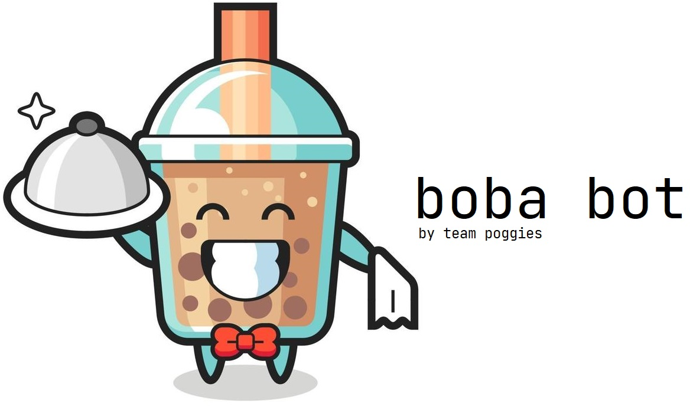

# boba-bot


Team Poggies' submission for Sunhacks 2021.
Find our project page on [Devpost](https://devpost.com/software/boba-bot), and a video demonstration can be found on [YouTube](https://www.youtube.com/watch?v=YGLsBpBqap0&ab_channel=tenmo).
## Commands
```
$help: lists the commands.
$preference: change your preferences for tea, each separated by a space.
$allergy: change your allergies, each separated by a space.
$make: makes a boba for you!
$list: lists the choices.
$user: displays the users current Preferences and Allergies.
```

## Build Instructions
1. Create a `auth.py` in the same directory as `main.py` with a variable `botToken` that contains the bot token for your bot
### Windows
```bat
:: Create virtual environment
$ python -m venv venv

:: Start virtual environment
$ call venv/scripts/activate.bat

:: Install required packages
$ pip install -r requirements.txt

:: Run the bot
$ python main.py

:: Leave the virtual environment
$ deactivate
```

### Linux
```bash
# Create virtual environment
$ python3 -m venv venv

# Start virtual environment
$ source venv/bin/activate

# Install requried packages
$ pip install -r requirements.txt

# Run the bot
$ python3 main.py

# Leave the virtual environment
$ deactivate
```